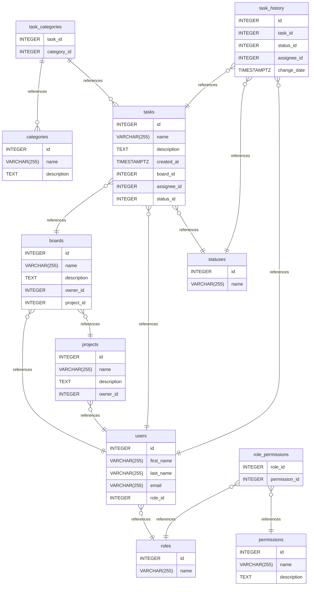

# Entity Relationship Diagram

# DueIt documentation
## Summary

- [Entity Relationship Diagram](#entity-relationship-diagram)
- [DueIt documentation](#dueit-documentation)
  - [Summary](#summary)
  - [Introduction](#introduction)
  - [Database type](#database-type)
  - [Table structure](#table-structure)
    - [users](#users)
    - [boards](#boards)
    - [roles](#roles)
    - [tasks](#tasks)
    - [categories](#categories)
    - [task\_categories](#task_categories)
    - [statuses](#statuses)
    - [task\_history](#task_history)
    - [projects](#projects)
    - [permissions](#permissions)
    - [role\_permissions](#role_permissions)
  - [Relationships](#relationships)
  - [Database Diagram](#database-diagram)

## Introduction
An online task management board where users can create and organize team tasks. Entities include users, roles, and tasks. Below is an overview of the tables and the ERD. 

## Database type

- **Database system:** PostgreSQL
## Table structure

### users

| Name        | Type          | Settings                      | References                    | Note                           |
|-------------|---------------|-------------------------------|-------------------------------|--------------------------------|
| **id** | INTEGER | 🔑 PK, not null, unique, autoincrement |  | |
| **first_name** | VARCHAR(255) | not null |  | |
| **last_name** | VARCHAR(255) | not null |  | |
| **email** | VARCHAR(255) | not null |  | |
| **role_id** | INTEGER | not null | fk_users_role_id_roles | | 

### boards

| Name        | Type          | Settings                      | References                    | Note                           |
|-------------|---------------|-------------------------------|-------------------------------|--------------------------------|
| **id** | INTEGER | 🔑 PK, not null, unique, autoincrement |  | |
| **name** | VARCHAR(255) | null, default: Untitled |  | |
| **description** | TEXT | null |  | |
| **owner_id** | INTEGER | null | fk_boards_owner_id_users | |
| **project_id** | INTEGER | not null | fk_boards_project_id_projects | | 

### roles

| Name        | Type          | Settings                      | References                    | Note                           |
|-------------|---------------|-------------------------------|-------------------------------|--------------------------------|
| **id** | INTEGER | 🔑 PK, not null, unique, autoincrement |  | |
| **name** | VARCHAR(255) | not null, default: user |  | | 

### tasks

| Name        | Type          | Settings                      | References                    | Note                           |
|-------------|---------------|-------------------------------|-------------------------------|--------------------------------|
| **id** | INTEGER | 🔑 PK, not null, unique, autoincrement |  | |
| **name** | VARCHAR(255) | null |  | |
| **description** | TEXT | null |  | |
| **created_at** | TIMESTAMPTZ | not null |  | |
| **board_id** | INTEGER | not null | fk_tasks_board_id_boards | |
| **assignee_id** | INTEGER | null | fk_tasks_assignee_id_users | |
| **status_id** | INTEGER | not null | fk_tasks_status_id_statuses | | 

### categories

| Name        | Type          | Settings                      | References                    | Note                           |
|-------------|---------------|-------------------------------|-------------------------------|--------------------------------|
| **id** | INTEGER | 🔑 PK, not null, unique, autoincrement |  | |
| **name** | VARCHAR(255) | not null |  | |
| **description** | TEXT | null |  | | 

### task_categories

| Name        | Type          | Settings                      | References                    | Note                           |
|-------------|---------------|-------------------------------|-------------------------------|--------------------------------|
| **task_id** | INTEGER | 🔑 PK, not null, unique, autoincrement | fk_task_categories_task_id_tasks | |
| **category_id** | INTEGER | 🔑 PK, not null | fk_task_categories_category_id_categories | | 

### statuses

| Name        | Type          | Settings                      | References                    | Note                           |
|-------------|---------------|-------------------------------|-------------------------------|--------------------------------|
| **id** | INTEGER | 🔑 PK, not null, unique, autoincrement |  | |
| **name** | VARCHAR(255) | not null |  | | 

### task_history

| Name        | Type          | Settings                      | References                    | Note                           |
|-------------|---------------|-------------------------------|-------------------------------|--------------------------------|
| **id** | INTEGER | 🔑 PK, not null, unique, autoincrement |  | |
| **task_id** | INTEGER | not null | fk_task_history_task_id_tasks | |
| **status_id** | INTEGER | not null | fk_task_history_status_id_statuses | |
| **assignee_id** | INTEGER | null | fk_task_history_assignee_id_users | |
| **change_date** | TIMESTAMPTZ | not null |  | | 

### projects

| Name        | Type          | Settings                      | References                    | Note                           |
|-------------|---------------|-------------------------------|-------------------------------|--------------------------------|
| **id** | INTEGER | 🔑 PK, not null, unique, autoincrement |  | |
| **name** | VARCHAR(255) | null |  | |
| **description** | TEXT | null |  | |
| **owner_id** | INTEGER | null | fk_projects_owner_id_users | | 

### permissions

| Name        | Type          | Settings                      | References                    | Note                           |
|-------------|---------------|-------------------------------|-------------------------------|--------------------------------|
| **id** | INTEGER | 🔑 PK, not null, unique, autoincrement |  | |
| **name** | VARCHAR(255) | null |  | |
| **description** | TEXT | null |  | | 

### role_permissions

| Name        | Type          | Settings                      | References                    | Note                           |
|-------------|---------------|-------------------------------|-------------------------------|--------------------------------|
| **role_id** | INTEGER | 🔑 PK, not null, unique, autoincrement | fk_roles_permissions_role_id_roles | |
| **permission_id** | INTEGER | null | fk_roles_permissions_permission_id_permissions | | 

## Relationships

- **boards to users**: many_to_one
- **users to roles**: many_to_one
- **tasks to boards**: many_to_one
- **tasks to users**: many_to_one
- **task_categories to categories**: one_to_many
- **task_categories to tasks**: one_to_many
- **tasks to statuses**: many_to_one
- **task_history to tasks**: many_to_one
- **task_history to statuses**: many_to_one
- **task_history to users**: many_to_one
- **projects to users**: many_to_one
- **boards to projects**: many_to_one
- **role_permissions to roles**: many_to_one
- **role_permissions to permissions**: many_to_one

## Database Diagram

