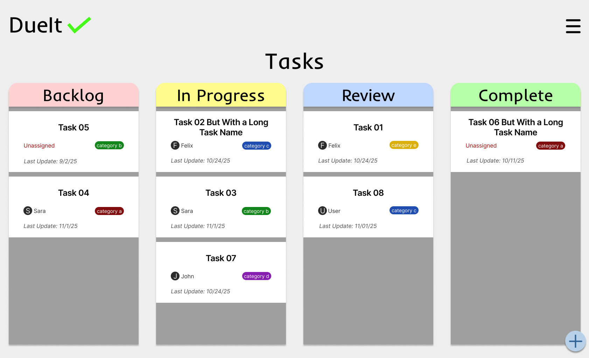
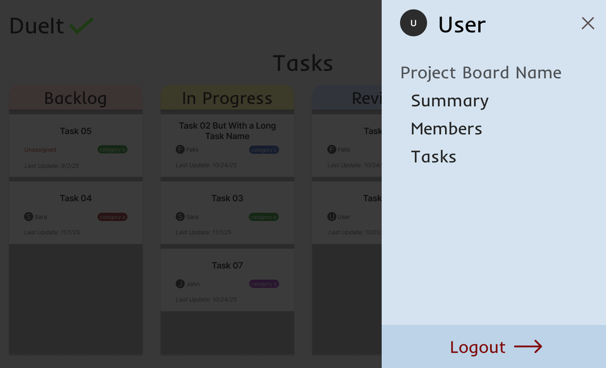
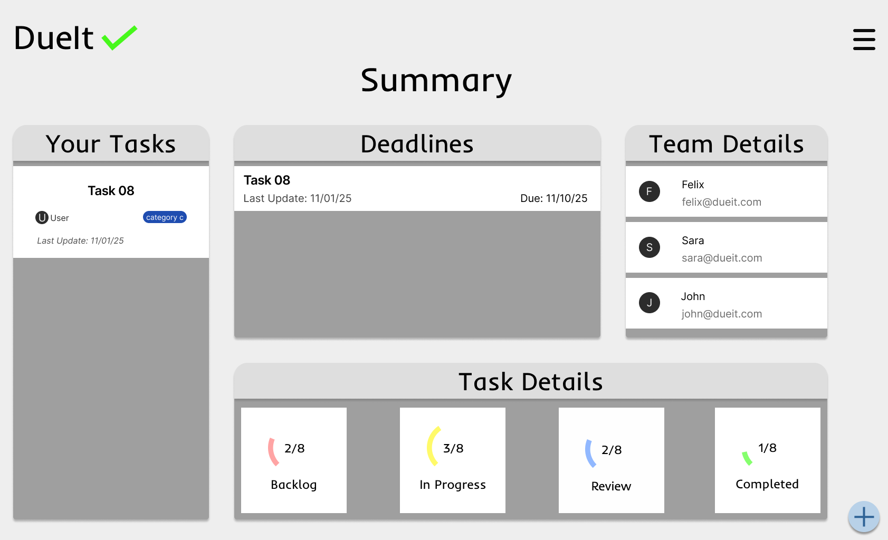
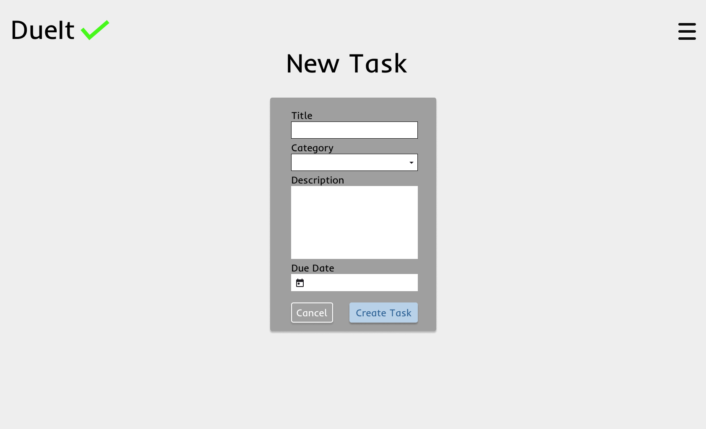
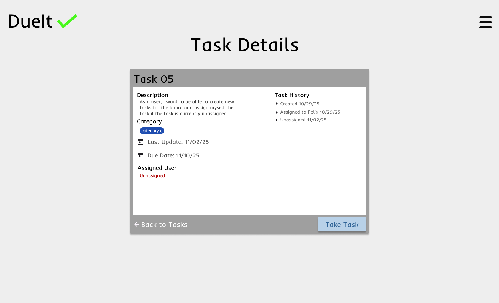

# Wireframes

This is a list of high-fidelity wireframes for a couple of pages of the
application. Pages with example wireframes are marked with '⭐' in the title.

## List of Pages

## Wireframe 1: Task Dashboard ⭐

## Wireframe 2: Navigation Overlay ⭐

## Wireframe 3: Project Summary Page ⭐

## Wireframe 4: New Task Form ⭐

## Wireframe 5: Task Detailed View ⭐

## Wireframe 6: User Signup Form

Where a user would create an account via signup form.

## Wireframe 7: User Login Form

Where a user would login using existing credentials.

## Wireframe 8: Application Landing Page

Where all users would go when not logged into the application.

## Wireframe 9: Task Detail Edit form

Where users would edit details of an existing task.
